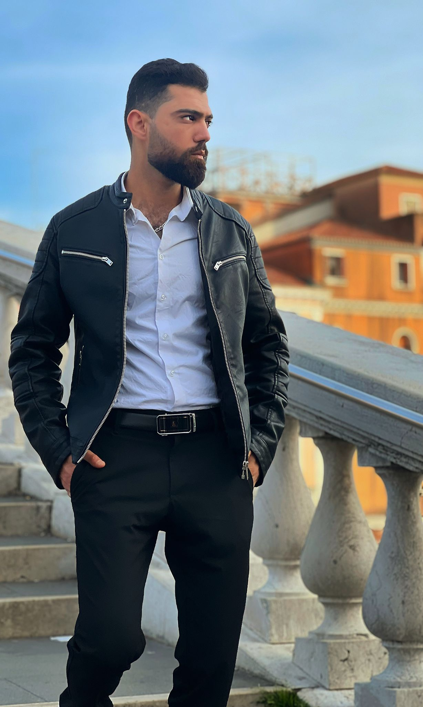

# ABRASH MOHAMMED

---

## About Me

I’m Mohammad, a graphic designer and photographer from Syria, based in Belgium.
Currently learning front-end development to enhance my creative and technical
skills.

---

## Languages

.Arabic

.English

.Dutch

.Turkish

---

## Skills

### **_Graphic Design_**

. Proficient in : _Adobe Photoshop_, _CorelDRAW_

### Front-End Development

. Learning the basics of :

_HTML, CSS, JavaScript_

.Improving skills in:

_Responsive Design_

_Git & GitHub_

## Contact :

. Email : abrashmohammed151@gmail.com

GitHub : [github.com/Mohammed-ABR](https://github.com/Mohammed-ABR)
