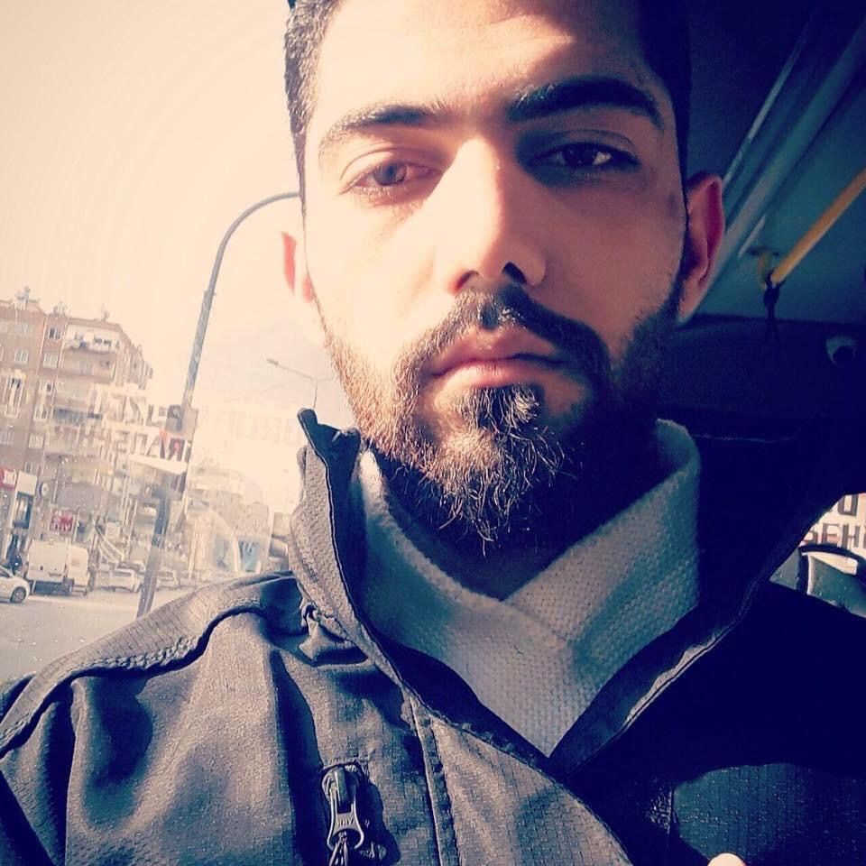

# ABRASH MOHAMMED

<<<<<<< HEAD

=======

>>>>>>> origin/main

---

## About Me

I’m Mohammad, a graphic designer and photographer from Syria, based in Belgium.
Currently learning front-end development to enhance my creative and technical
skills.

---

## Languages

<<<<<<< HEAD
.Arabic

.English

.Dutch

.Turkish
=======
- Arabic

- English

- Dutch
- Turkish
>>>>>>> origin/main

---

## Skills

<<<<<<< HEAD
### **_Graphic Design_**

. Proficient in : _Adobe Photoshop_, _CorelDRAW_

### Front-End Development

. Learning the basics of :

_HTML, CSS, JavaScript_

.Improving skills in:

_Responsive Design_

_Git & GitHub_

## Contact

. Email : <abrashmohammed151@gmail.com>

GitHub : [github.com/Mohammed-ABR](https://github.com/Mohammed-ABR)
=======
### **Graphic Design**

- Proficient in : _Adobe Photoshop_, _CorelDRAW_

### Front-End Development

- Learning the basics of :

HTML, CSS, JavaScript

- Improving skills in:

Responsive Design

Git & GitHub

## Contact

- Email : <abrashmohammed151@gmail.com>

- GitHub : [github.com/Mohammed-ABR](https://github.com/Mohammed-ABR)
>>>>>>> origin/main
